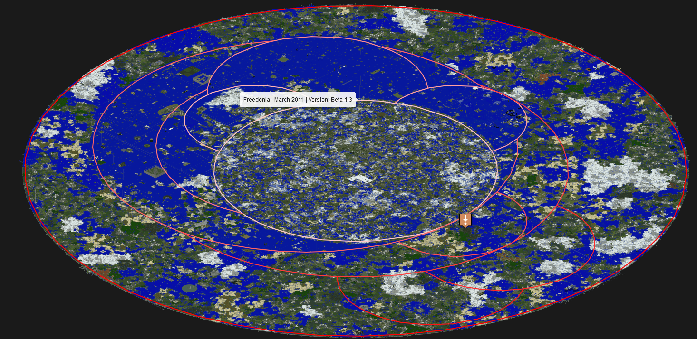
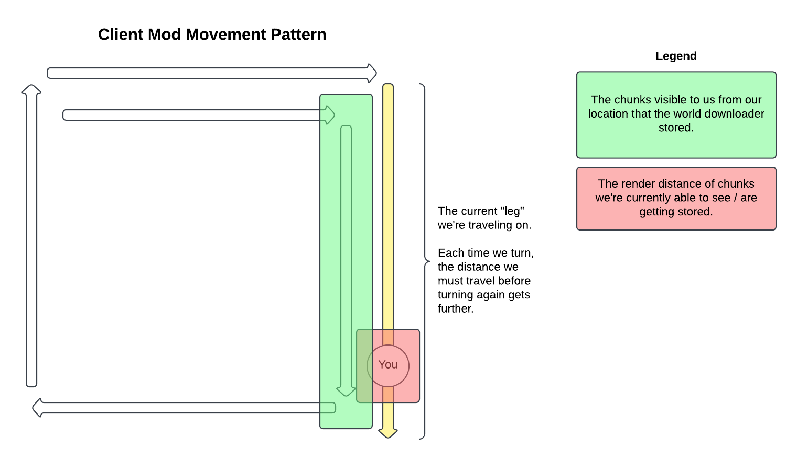
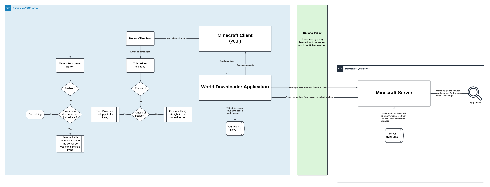

# Minecraft: Digital Archiving
TL;DR - This is a Meteor Client addon that I built to assist me in archiving the entire world of the oldest Minecraft server.
I downloaded the entire Minecraft world by using this mod addon to automatically navigate me across the world. I succeeded!

This repository is the code for the addon which works and can be used. I've included a long write-up here on the entire
project, why I did it, how I planned for it, adapted to changes in moderation attentiveness, and successfully archived
the entire server overworld.

# Target Server: MinecraftOnline.com
[MinecraftOnline.com](https://minecraftonline.com) is commonly referred to as the _oldest_ ~~anarchy server~~ Minecraft
server to still be running. Their wiki states the server was launched within an hour of Mojang releasing Minecraft multiplayer
publicly and making server jars available.

I highly recommend visiting their website and accompanying wiki. They contain a wealth of information on the server history,
staff, eras, organizations, mishaps, etc. It was a pleasure to get to read through, although it'd take you weeks of reading
on end to make it through everything.

## Why This Server?
First and foremost, I'm a digital historian and have a passion for archiving precious digital memories that could otherwise
be lost to time. Prior to this little endeavor I [digitized](https://www.post-gazette.com/life/goodness/2024/10/17/chartiers-valley-scott-bridgeville-high-schools-yearbooks-project/stories/202410170008) 
hundreds of years of yearbooks and made them available for free [online](https://chartiersvalley.com).

I played Minecraft when I was young, and it's what I credit my brother and I's strong relationship for. We'd spend hours 
a day for years building on our [own server](https://pilzbros.com). 10+ years later and it's still something we do from time to time.

I came across [SalC1's Video](https://www.youtube.com/watch?v=HrUX1XJkoU4) about MinecraftOnline.com, how it was the oldest
Minecraft server, and how the apparent ineffective administration have caused many issues in its operation. In an act of
selflessness and digital historianism, SalC1 donated thousands of dollars for the server to be moved to more modern hardware.
Unfortunately, the administration team wasted the entire funds on a test server that was never used. A huge chance to
revitalize a milestone for the community, squandered. MinecraftOnline.com documents two "invasions" as a result of SalC1's
videos, one in [2017](https://minecraftonline.com/wiki/SalC1_Invasion) and [another](https://minecraftonline.com/wiki/Double_Trouble_Invasion) 
in 2023.

Coincidentally, the 2023 invasion wiki post states that as of Feburary 2023 the server was planning to update to Minecraft
`1.19.3`. As of November 2024, it's still on `1.12.2`.

My goal is not to disparage the hard work of the administrators of the server. It's an impossible and thankless job to 
maintain a server and community of this magnitude in your spare time. Keeping the service free and accessible comes with
personal sacrifice. However, with that being said, my trust in their ability to forever maintain a historical gem like
this began to erode.

What happens if the server goes down one day and just doesn't come back up? There's no guarantee the world download would
be made available. Links for temporary world downloads throughout the wiki are broken. Imagine growing up building on this
server. You're one of the 306,000 unique players that spend hours/days/months/years building and growing up alongside
others. Imagine not being able to look back one day on what you built.

I have endless nostalgia for Minecraft and absolutely treasure the worlds I have from over the last 10 years. I know
thousands of people treasure their memories on the server. Backups should follow the 3-2-1 rule, where the 1 is an
off-site backup. 

I was about to create the unsanctioned off-site backup.

## Map Structure

The middle most tan colored ring, labeled `Freedonia (March 2011)` was the original world border since the server began
in Minecraft Beta 1.3 until it was expanded in 2013. The outermost red ring represents the current (2024) world border.

For this project, I was only concerned with capturing the original most map from 2011. Anything extra was simply a bonus.
Speaking purely from the density of builds, it appears the majority of growth on the server happened between 2011 and 2013,
with relatively little in the expansion areas. This could easily be untrue as I do not have the server data to validate
those claims.

You can view the map using the [Minecraft Online Map Viewer](https://minecraftonline.com/map/#/-3086/64/1181/-9/Freedonia%20-%20overworld/World).
The viewer came in extremely handy when setting goals for the project as it allowed me to know roughly what and where I
needed to capture. I frequently referred to it while my mod and world downloader were carving large chunks out, I wanted
to make sure I was only targeting `Freedonia` in the beginning.

## Server Challenges

- Of the three rules on the server, using a hacked client for flight was prohibited. This immediately tells you that you'll be doing some deep configuration to avoid detection, kicks, and bans.
- The server _still_ runs on `Minecraft 1.12.2`. That's pretty old. You're unlikely to find active mod/tooling support for it. Coincidentally, my [Friday the 13th Minecraft](https://f13mc.com) server is still on 1.12.2. I just couldn't be arsed to rewrite everything when 1.13 broke like, every major API.
- The physical server is old or sure feels like it. They don't publish the current TPS counts, but Sal1C videos routinely documented it below 10 TPS, making basic functions like riding Minecarts impractical.

These were the main concerns I had going into the project. Further down I publish a full list of learnings and adaptations
I came across.

## The Plan
Alright we have our target (MinecraftOnline.com), we have a motive (digital preservation), and now we need a tool to make
it all happen. 

### The Downloader
We can yeet ourselves around a map all we want, but the entire purpose of this project is to archive the world. For that,
we'll need to download it.

I used the [minecraft-world-downloader](https://github.com/mircokroon/minecraft-world-downloader), a standalone proxy
application that writes the chunks you're exploring in Minecraft to disk. Once you're finished, you can open that save
as a single-player world or host it on your own server. 

1. You run the world downloader as an application on your computer. It hosts itself on a port and authenticates itself with Microsoft/Mojang using your account.
2. In your Minecraft client (with your mods), you connect to the port defined in the previous step.
3. The world downloader becomes a proxy. It sits between you and your destination server. As you explore the server, it intercepts the chunks and stores them locally.
4. When you're done, you have the world downloaded. Some restrictions apply.

**Perhaps the most important thing to call out here is that for the download to work, you have to explore every single chunk
you wish to download.** At least at time of writing, there is no way to download a server's world (as a player) like you'd
download a single file from the internet. The process outlined here is saving chunks of the world as you go to hopefully
produce a full world save as long as you explore it all.

This is _rough_ for large maps. Similar efforts have been done on 2b2t. You can read about it on [Reddit](https://old.reddit.com//r/2b2t/comments/t287n9/1170gb_of_2b2t_256000%C2%B2_mapping_project_info/)
and download the 1.17TB spawn world download via [this torrent](https://cloud.daporkchop.net/minecraft/2b2t/torrents/2b2t_256k%c2%b2_spawn_download.torrent).
For this effort, they traveled 128 _THOUSAND_ blocks in each direction. For reference, the MincraftOnline.com overworld
is only ~20,000 blocks wide in each direction.

The final important quirk of the downloader is what it's actually able to capture. There's a lot in a Minecratf world
besides blocks. There are entities (armor stands), item frames, signs with text, chests with loot, etc. How the Minecraft
server stores this data and allows access to it varies.

Looking at the downloader's [feature compatibility](https://github.com/mircokroon/minecraft-world-downloader/wiki/Features)
chart, the _server_ being on `1.12.2` brings the following challenges:
- We cannot download map contents. There goes map art.
- We cannot download the contents of item frames, armor stands, command blocks, and villager trades.
- We cannot download ender chest contents. They're implemented specially in Minecraft and require each player to access the chest to obtain the contents.
- We can get everything else, though, like chest contents!

### The Translation Layer
You're not going to find any resources for making a client-side Fabric mod for Minecraft `1.12.2`. Instead, like me, you
should probably use the most modern client mod libraries available.

To allow my modern mod to work on the legacy server version, you can also install [ViaFabricPlus](https://github.com/ViaVersion/ViaFabricPlus)
in your client as a mod. If you're a server administrator you've likely used the Via teams' plugins before to allow clients
to play on the server with client versions that differ from that of the server. ViaFabricPlus is no exception in the magic.
It allows your _client_ to handle packet translation between the destination server version and the client.

This allowed me to run a Minecraft `1.21.3` client mod and connect to a Minecraft `1.12.2` server with minimal issues. The
destination server has no idea you're not on the version it's expecting, it's the perfect crime.

### The Client-side Mod
We have the ability to download worlds and our client is able to connect to _any_ server version - now what?

We need to create a client-side mod that:
- Uses an existing fly hack to allow us to fly and travel at great speeds. Remember - time is chunks!
- Allows us to enable/disable the archiving functionality.
- Automagically move us towards the next point where we need to turn, taking us in a clockwise spiral to visit _all_ chunks on the server.
- Overlap _somewhat_ with chunks we've already seen so we're sure we have them saved.
- Handle being kicked and automatically resuming where we left off.
- Reduce chance for conflict and disconnect when we detect mods/admins that could give us the bam hammer.
- Hopefully doesn't siphon the little sanity we had left.

When enabled, the mod will fly in a clockwise spiral covering all chunks as it works its way outward towards the world
border.

## Architecture

## Let's Do This

Let's set our "North Star" of the project and make sure we have reasonable expectations. When I work on professional projects
I like to set a North Star to act as a goal post we can always reference to answer the question "are we on the right track?"
- We want to download the world for historical preservation purposes. We're not doing it for sale, exploit, or anything that would result in personal gain.
- We chose this server due to its historical sinifigance in our community.
- We're downloading the world as a client/player. We do **not** have access to any resources the server doesn't permit. We're going to store every chunk, but not every chunk will have 100% accuracy due to block capture capabilities.
- The resulting download will not have any server plugins. The functionality made available by the plugins is what makes a server feel "alive" and less hollow. We won't have that. There's no plot claims. No block history, nothing.

Finally and most importantly: The historical archive we're going to make is not a 1:1 port of the experience you get from
playing on the original server. We're preserving things for nostalgia and future Minecraft gamer generations. You can't
appreciate Minecraft until you've cut down a beta tree.

### Setup Guide
The mod addon I've created here works well and works standalone if yeeted into a client via jar. When running this project
I launched the client from my IDE, so I could tweak code as we went, see console output, and honestly it was easier than
dealing with gradle.

1. Clone the repo locally and open it in your IDE (preferably IntelliJ)
2. In the run configurations, run the `Minecraft Client` option. This will compile the addon and install it in a Minecraft client along with Meteor Client and Fabric. It's legitimately magic how this works.
3. Once it launches, close it, we have work to do.
4. In the project viewer, open the `run/mods` folder. Any mods placed here will be automatically loaded into the client you're launching from your IDE.
5. Install [ViaFabricPlus](https://github.com/ViaVersion/ViaFabricPlus) by placing the jar in the folder. This mod allows our modern client `1.21.3` to connect to older server versions.
6. Install [Sodium](https://modrinth.com/mod/sodium/versions) by placing the jar in the folder. This mod greatly improves rendering performance. We're going to be visiting a _lot_ of chunks with a large render distance. This mod is essential for your client to keep up. If you lag, you get kicked. More on this later.
7. You're set, run `Minecraft Client` and you have a fully functioning client ready for downloading. You should see `World Archiver by PilzBros` in the upper right hand side in the main menu.
8. In Meteor (press right shift) once in the menu, enable the following modules:
   - Anti Hunger -  It saves you from needing food whilst flying.
   - Flight Module - Enable this addon.
     - Mode: `Velocity` (Abilities got me kicked real fast)
     - Speed: `0.699`
     - Verticle Speed Match: `true`
     - Anti-Kick:
       - Mode: `Packet`
       - Delay: `10`
       - Off Time: `10`
   - Auto Reconnect
     - You can set the delay to as few or many seconds as you like. Immediate rejoins can be sus to mods/admins paying attention. I commonly went with 30s, but honestly a dynamic value could go a long way here.
9. Start the World Downloader executable. This will open a GUI where you can configure which server it should proxy to. Click `Start`.
10. In your Minecraft client, add a new multiplayer server with the IP `localhost`.
11. When you connect to the server you added, you'll connect to the destination server and the downloader will begin downloading chunks.

### Starting the Scan
When starting from the very first chunk of the project, go to the center of the map. When you're ready, enable the `Archiver Module`
module. It will begin flying your player in the direction you're looking, turn 90 degrees, go a bit more, rinse and repeat.

I recommend you enable the `Helper Module`. If you get disconnected / kicked, this module is what automatically resumes
the flying (what I refer to as scanning) process where you left off. If this module isn't enabled and you reconnect,
you'll have to manually toggle the `Archiver Module` off and on again.

Let's say you get banned, the server goes down, your internet goes out, etc. The scanning process was interrupted. There
are commands on the addon that allow us to pick up where we left off by manually flying a segment. Toggle off the `Archiver Module`
and `Helper Module`.

Fly to the corner closest to where you left off. Face the direction you want us to fly forward in for the next leg of the
scan. Execute the command `.archiver reset`. This command tells the addon to start from here. Now, fly your player **manually**
straight all the way to where it will need to turn next. Stop where the player would need to turn to begin the next segment.
Remain facing the direction you were heading when flying manually. Execute the command `.archiver resume`.

Finally, enable the `Archiver Module`. It will take over flight responsibilities and handle things from there. Don't
forget to also enable the `Helper Module` in case you get kicked or else you'll have to do this again.

### Flying Over the Radar

When I first began downloading I would just join the server whenever I had time, like after work. I'd set the mod to run,
it would begin sweeping through the tiny beginning squares and slow work its way out.

I made it a few hours before I got banned by a mod. They do this "interrogation" thing where they TP you to `-18165,14236`
and give you the shake down. Cut your losses, you're already done. They "trail" you.

You're going to need several accounts to pull this project off if the server you're targeting has vigilant staff. I asked
a few friends if I could use and subsequently get their accounts banned. I looked into alt account leasing services, but
the world downloader _also_ needs your auth token to function and synchronizing that was just... not going to happen in
this scope. I calculated that I had enough willing friends with accounts to get me to the finish line.

You'll also need to use a VPN. They have ban evasion plugins that alert them when a new account joins from an IP that
is associated with banned players. I had to jump between some servers I owned. At some point an admin was asking about
my ISP setup and surmised it "must be on how they translate customer addresses". I'm sorry to report that's a lie, you
were right about me evading bans. 

1 AM ET - 4 AM ET was consistently the period with the least amount of moderators online. Any admin online was an instant
no-go, but the wiki admits mods have limited visibility into the server. 

When you get kicked from the server, you'll get the `Flying is not enabled in this server` error. This kick message does
_not_ get broadcast all players online. It does, however, get put into the console logs. They have a Discord Bot that 
yeets this info into a [channel](https://discord.com/channels/288050647998136323/1007803559624061010). This message
does include the flying message. If you have people paying attention to this Discord channel, you self report that you
were flying. This is amplified significantly if you're constantly being kicked for flying. It becomes too easy to look
at the chat history and see you're up to no good.

Your goal is to fly as far and much as you can while minimizing the number of times you're kicked, all while weighing
the risk of exposing yourself to the players currently online.

### Conflict Avoidance

I mentioned that flying while an admin is online is a no-go. I added a `Conflict Avoidance` module to this addon that
automatically stops the archiving process and disconnects you if:
- It detects any admin online via chat join messages; or
- It hears any admin username mentioned in chat.

I also considered adding a "safety score" mechanic that weighed how risky it would be to archive given the staff online.
Again, their wiki provided entirely too much information and I would say is short of a privacy violation. Their wiki
details every single mod and admin. Each have a profile with their name, birthday (???), location (timezome), and more.
It was entirely too easy to tell the module which admins and mods to avoid and save us a fresh account ban.

## !! The Results  !!
There was a lot of preparation and trail and error that went into this whole project. The majority of the work was
figuring out the patterns of the server and community, optimizing my window for action, getting the mod addon flying
effectively, and going to bed while it scanned away. I love the smell of fresh bans in the morning.

In total, it took about 8 hours of the addon flying my players around Freedonia to download **every single chunk** of the
original world.

I went through 5 Minecraft accounts. Each one was banned by the same mod. I suspect they were bored and trailing people
for funsies. There are _several_ other bots (like myself here) on the server that somehow evade the mods. Hats off to you.

The world is ~ 7 GB uncompressed. For comparison, the 2b2t world is reportedly over 64 TB.

You can download the world from the Internet Archive. 

### Recommendations for MinecraftOnline.com
In the off chance that someone from MinecraftOnline.com is reading this and has spent the time getting to this point, I
wanted to include some recommendations on how to tighten things up.

Honestly the biggest weakness is the wiki. It has _entirely_ too much personal information about the staff. I was able
to figure out every single admin/mod, their in-game name to use for programmatic avoidance, their time zone to figure out
when the majority would be offline, and other quirks that came in handy.

I'm a huge proponent of documentation and documenting the history/lore of the server. The written history is the one that
transcends generations. In my opinion, there is a limit on how much you can/should safely expose to the outside world.

### Conclusion
Overall this was a super fun project. I'd been wanting to teach myself client-side modding after spending 10+ years
working in Velocity/Spigot server-side plugins. I learned some basics of Fabric modding and the framework available to
you.

My interactions on the server were great. The community is welcoming and kind. While my client was flying around the
world I would sometimes engage in chat and everyone was super kind. When one of my accounts got banned, there was a mini
revolt in chat (which I could monitor in Discord) over it. 

This reinforced my belief of the importance for digital preservation. Servers especially exist only as long as
the owner pays the bill. They have a low bus factor. If we want to preserve these memories for tears to come, we have
to distribute copies of these worlds for players to hold onto.

Finally, the strong pull of the community on [MinecraftOnline.com](https://minecraftonline.com/) is something special to behold. Many players
are old, many are new. The lore runs deep and so too are the wishes for more TPS'. It's rare to see a community so loving
and engaged in an online escape. Thank you for letting me be part of it for my short stint.

